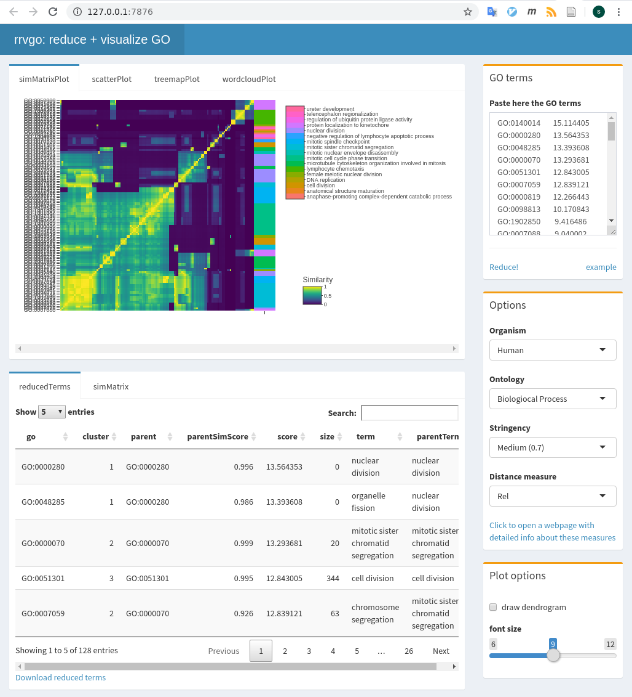

```{r pre, echo=FALSE, results='hide'}
library(knitr)
opts_chunk$set(warning=FALSE, message=FALSE, cache=TRUE)
```

```{r style, echo=FALSE, results='asis'}
BiocStyle::markdown()
```

# Introduction to rrvgo

Gene Ontologies (GO) are often used to guide the interpretation of high-throughput
omics experiments, with lists of differentially regulated genes being summarized
into sets of genes with a common functional representation. Due to the hierachical
nature of Gene Ontologies, the resulting lists of enriched sets are usually
redundant and difficult to interpret.

`rrvgo` aims at simplifying the redundance of GO sets by grouping similar terms
in terms of semantic similarity. It also provides some plots to help with
interpreting the summarized terms.

This software is heavily influenced by [REVIGO](http://revigo.irb.hr/). It mimics
a good part of its core functionality, and even some of the outputs are similar.
Without aims to compete, `rrvgo` tries to offer a programatic interface using
available annotation databases and semantic similarity methods implemented in the
Bioconductor project.

# Using rrvgo

## Getting started

Starting with a list of genes of interest (eg. coming from a differential expression
analysis), apply any method for the identification of eneriched GO terms (see 
[GOStats](https://www.bioconductor.org/packages/release/bioc/html/GOstats.html) or
[GSEA](https://www.gsea-msigdb.org/gsea/index.jsp])).

`rrvgo` does not care about genes, but GO terms. The input is a vector enriched
GO terms, along with (recommended, but not mandatory) a vector of scores. If scores
are not provided, `rrvgo` takes the GO term (set) size as a score, thus favoring
*broader* terms.

## Calculating the similarity matrix and reducing GO terms

First step is to get the similarity matrix between terms. The function `calculateSimMatrix`
takes a list of GO terms for which the semantic simlarity is to be calculated,
an `OrgDb` object for an organism, the ontology of interest and the method to
calculate the similarity scores.

```{r}
library(rrvgo)
go_analysis <- read.delim(system.file("extdata/example.txt", package="rrvgo"))
simMatrix <- calculateSimMatrix(go_analysis$ID,
                                orgdb="org.Hs.eg.db",
                                ont="BP",
                                method="Rel")
```

The `semdata` parameter is not mandatory as it is calculated on demand. If the
function needs to run several times with the same organism, it's advisable to
save the `GOSemSim::godata(orgdb, ont=ont)` object, in order to reuse it between
calls and speedup the calculation of the similarity matrix.

From the similarity matrix one can groups terms based on similarity. `rrvgo`
provides the `reduceSimMatrix` function for that. It takes as arguments i) the
similarity matrix, ii) an optional *named* vector of scores associated to each
GO term, iii) a similarity threshold used for grouping terms, and iv) an orgdb
object.

```{r}
scores <- setNames(-log10(go_analysis$qvalue), go_analysis$ID)
reducedTerms <- reduceSimMatrix(simMatrix,
                                scores,
                                threshold=0.7,
                                orgdb="org.Hs.eg.db")
```

`reduceSimMatrix` selects as the group representative the term with the higher
score within the group. In case the vector of scores is not available, `reduceSimMatrix`
will get the GO term size from the `OrgDb` object and use it as the score, thus
favoring broader terms. **Please note that scores are interpreted in the direction that higher are better**, 
therefore if you use p-values as scores, log-transform them before.

Higher the thresholds force higher similarity between terms of a groups, resulting
in a higher number of groups.

## Plotting and interpretation

`rrvgo` provides several methods for plotting and interpreting the results.

### Similarity matrix heatmap

Plot similarity matrix as a heatmap, with clustering of columns of rows turned
on by default (thus arranging together similar terms).

```{r}
heatmapPlot(simMatrix, reducedTerms, annotateParent=TRUE, annotationLabel="parentTerm", fontsize=6)
```

The function internally uses [`pheatmap`](https://cran.r-project.org/web/packages/pheatmap/index.html),
and further parameters can be passed to this function.

### Scatter plot depicting groups and distance between terms

Plot GO terms as scattered points. Distances between points represent the
similarity between terms, and axes are the first 2 components of applying a PCoA
to the (di)similarity matrix. Size of the point represents the provided scores 
or, in its absence, the number of genes the GO term contains.

```{r}
scatterPlot(simMatrix, reducedTerms)
```

### Treemap plot

Treemaps are space-filling visualization of hierarchical structures. The terms
are grouped (coloured) based on their parent, and the space used by the term is
proportional to the score. Treemaps can help with the interpretation of the 
summarized results and also comparing between differents sets of GO terms.

```{r}
treemapPlot(reducedTerms)
```

The function internally uses [`treemap`](https://cran.r-project.org/web/packages/treemap/index.html),
and further parameters can be passed to this function.

### Word cloud

Word clouds are visualizations which reproduce putting emphasis to words which
appear frequently in a text. Can help to identify processes and functions that
happen more commonly in a set of enriched GO terms, as well as comparing between
different sets.

```{r}
wordcloudPlot(reducedTerms, min.freq=1, colors="black")
```

The function internally uses [`wrodcloud`](https://cran.r-project.org/web/packages/wordcloud/index.html),
and further parameters can be passed to this function.

## Shiny app

To make the software more accessible to a non-technical audience, `rrvgo` packages
a shiny app which can be accessed calling it the `shiny_rrvgo()` function from
the R console.

```{r, eval=FALSE}
rrvgo::shiny_rrvgo()
```



The app offers *interactive* access to the plots and tables calculated by `rrvgo`.

# Currently supported

## Similarity methods

All similarity measures available are those implemented in the
[GOSemSim package](https://www.bioconductor.org/packages/release/bioc/html/GOSemSim.html),
namely the Resnik, Lin, Relevance, Jiang and Wang methods. See the
[Semantic Similarity Measurement Based on GO](https://www.bioconductor.org/packages/release/bioc/vignettes/GOSemSim/inst/doc/GOSemSim.html#semantic-similarity-measurement-based-on-go)
section from the GOSeSim documentation for more details.

## Organisms

Bioconductor current provides `OrgDb` objects for [20 species](https://www.bioconductor.org/packages/release/BiocViews.html#___OrgDb)
provided by the following packages:

| Package           | Organism                   |
|-------------------|----------------------------|
| org.Ag.eg.db      | Anopheles                  |
| org.At.tair.db    | Arabidopsis                |
| org.Bt.eg.db      | Bovine                     |
| org.Ce.eg.db      | Worm                       |
| org.Cf.eg.db      | Canine                     |
| org.Dm.eg.db      | Fly                        |
| org.Dr.eg.db      | Zebrafish                  |
| org.EcK12.eg.db   | E coli strain K12          |
| org.EcSakai.eg.db | E coli strain Sakai        |
| org.Gg.eg.db      | Chicken                    |
| org.Hs.eg.db      | Human                      |
| org.Mm.eg.db      | Mouse                      |
| org.Mmu.eg.db     | Rhesus                     |
| org.Mxanthus.db   | Myxococcus xanthus DK 1622 |
| org.Pf.plasmo.db  | Malaria                    |
| org.Pt.eg.db      | Chimp                      |
| org.Rn.eg.db      | Rat                        |
| org.Sc.sgd.db     | Yeast                      |
| org.Ss.eg.db      | Pig                        |
| org.Xl.eg.db      | Xenopus                    |

If the organism is not supported in Bioconductor, you can still build your own
`OrgDb` object usign the [`AnnotationForge`](https://bioconductor.org/packages/release/bioc/html/AnnotationForge.html)
package and rendering the necessary data for semantic similarity using the
`GOSemSim` package with:

```{r, eval=FALSE}
my_new_fancy_orgdb_object <- 'org.Zz.eg.db'
hsGO <- GOSemSim::godata(my_new_fancy_orgdb_object, ont="MF")
```

## Gene Ontologies

One of *Biologiocal Process* (BP), *Molecular Function* (MF) or *Cellular Compartment* (CC).

# Demo data

Taken as is from the [DOSE package](https://www.bioconductor.org/packages/release/bioc/html/DOSE.html),
which was derived from the R package [breastCancerMAINZ](https://www.bioconductor.org/packages/release/bioc/html/breastCancerMAINZ.html).
It contains 200 samples with breast cancer at different grades (I, II and III).
The dataset basically contains log2 ratios of the geometric means of grade III
vs. grade I samples ( 34 vs. 29 repectively).

# Citing rrvgo

Please consider citing rrvgo if used in support of your own research:

```{r citation}
citation("rrvgo")
```

## Reporting problems or bugs

If you run into problems using rrvgo, the [Bioconductor Support site](https://support.bioconductor.org/) is a good first place to ask for help. If you think there is a bug or an unreported feature, you can report it using the [rrvgo github site](https://github.com/ssayols/rrvgo/).

## Session info

The following package and versions were used in the production of this vignette.

```{r echo=FALSE}
sessionInfo()
```
